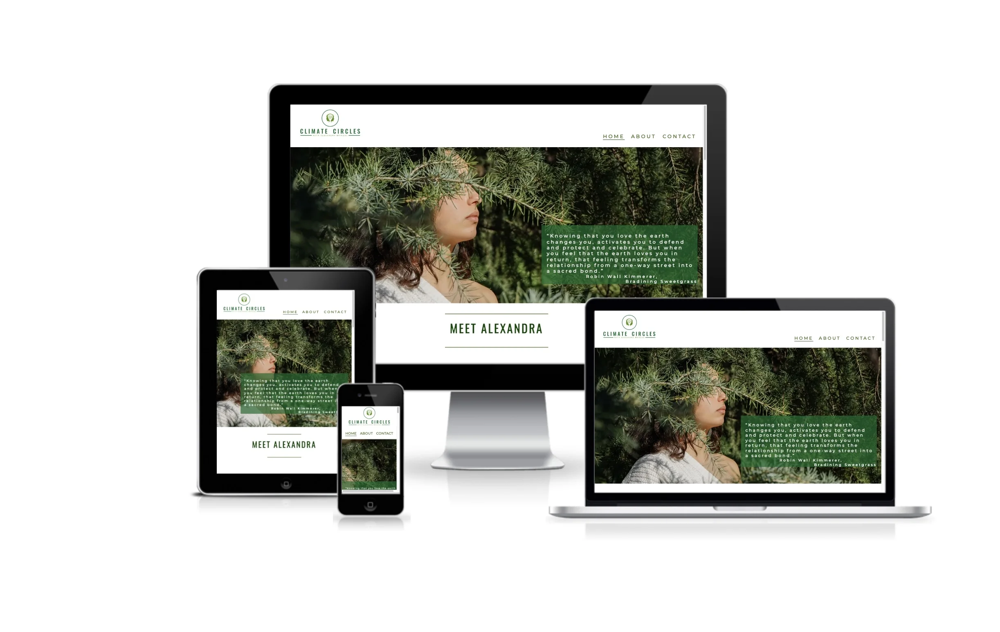
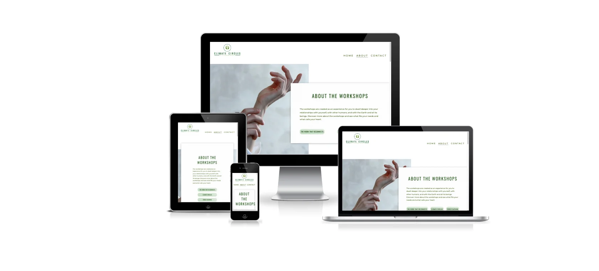
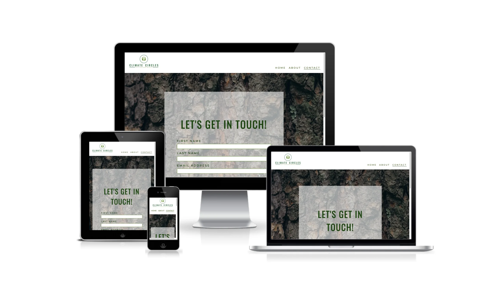

# Climate Circles
## Milestone Project One

This webite was created for Alexandra Brinzac, a psychologist specialised in experiential psychotherapy, with a passion for climate psychology, ecopsycholgy and nature-based therapies. After all the studies and experience that she gathered, she decided it's time to move further and create "Climate Circles", a place for people with the same love for nature, connection and Planet Earth. The role of this website is to raise awareness  about the importance of being in a circle and working together towards creating a just regenerative world. The means that we are reaching this are workshops of The World That Reconnects, Climate Circles and Forest Bathing sessions. 
***
## Demo

You can view the live website here - [Climate Circles](https://teodoraalina.github.io/climate-circles/)

You can view the GitHub repository here - [TeodoraAlina/climate-circles](https://github.com/TeodoraAlina/climate-circles)




***


## User Experience (UX)

## Strategy

### User Stories
#### First time Visitor Goals
* As a First Time Visitor, I want to understand the main purpose of the site with ease.
* As a First Time Visitor, I want to be able to navigate throughout the site with ease.
* As a First Time Visitor, I want the site to be visually appealing regardless of screen size.
* As a First Time Visitor, I want the links to function properly.
* As A First Time Visitor, I want to find out more about the workshops.
* As A First Time Visitor, I want to get in contact easily.

#### Returning Visitor Goals
* As a Returning Visitor, I want to know the times when the workshops are held.

#### Reasons a user may visit the website
* A user looking to know more about Alexandra.
* A user looking for a new hobby.
* A user doing research on what we offer.
* A user wanting to connect more with nature.
* A user searching for a way of relaxation.

#### Reasons for the Website
* Showcase work.
* Increase Climate Awareness.
* Provide a way for people to contact Alexandra.
* Increase people for participation on the workshops.

## Scope
* Let the audience know who we are and what we do.
* Show the audience about the workshops.
* List the times of the workshops.
* Convince the audience by adding experiences (testimonials) from other participants
* Make it easy to get in touch by telephone, email, social media or contact form.


## Structure

Based on the content required in the scope this website will consist of 3 pages:


* A Home Page, which will contain a small biography of Alexandra, testimonials and the meet-up times.
* An About Page with descriptions and benefits of the workshops.
* A Contact Page with a form to get in contact with Alexandra.

## Skeleton
* Home Page Wireframes - [desktop](assets/images/home-page-desktop.webp) / [mobile](assets/images/home-page-phone.webp) / [tablet](assets/images/home-page-ipad.webp).
* About Page Wireframes - [desktop](assets/images/about-page-desktop.webp) / [mobile](assets/images/about-page-phone.webp) / [tablet](assets/images/about-page-ipad.webp).
* Contact Page Wireframes - [desktop](assets/images/contact-page-desktop.webp) / [mobile](assets/images/contact-page-phone.webp) / [tablet](assets/images/contact-page-ipad.webp).

## Surface

### Imagery

The Images from the Workshops, In the About Page were given by Alexandra from her workshops, as the photo from "Meet Alexandra" on the Home Page.
I chose the Hero image from the Home page because of the simple feeling that sends you when you look at it, giving you a peaceful vibe when entering the website. The images from the "Meet-up Times" section were chosen to match the vibes of the workshops. In the background of the Contact Form I have chosen the stem of a tree for the nice contrast and also to keep the nature theme on the entire website.

Image Links:

*
*
*
*
*
*
*
*
*
*

### Colour

I have used three types of green on the entire website, which goes perfect with the theme of the webiste. I kept the background color white for contrast and also used white in writing on images, for the same reason.

### Typography

I have used https://fonts.google.com/ for my fonts. I have chosen to use Oswald for headers. Initially, I have chosen Quicksand for the content but because the contrast was not sufficient, I have changed to Montserrat, which is a similar font but brought better contrast and readability. I have increased the letter spacing to make the text more defined and decreased it in smaller screen sizes for responsiveness.

I imported the following code into the top of my style.css file:
```
@import url('https://fonts.googleapis.com/css2?family=Montserrat:wght@500&family=Oswald&display=swap'); 
```
### Call to Action
* The links in the Navigation bar are highlighted using a border bottom when the mouse is hovered over them.
* In the "About" page, the workshops have been styled as buttons to be more inviting for users to click. When hovered over, the colors switch.
* The "Submit" button has a nice brown earthy color which goes perfect with the background in the "Contact" page. The colors change when hovered over.
* The social media links will send the user to Alexandra's social media pages. They also change colour when hovered over.
***

## Features

### Navigation Links and Logo

The navigation links and logo are placed at the top of the screen. In bigger screen sizes, the logo stays in the left corner and the navigation links in the right corner of the screen. When on smaller screen sizes, the logo is centered and the navigation links go underneath the logo and are centered. When clicked, the logo takes the user to the home page. The navigation Links direct the user to the correct page of the website.

### Responsiveness 

The page is scaled up and down for different screen resolutions to help the content stay neat. This has been done using media queries.

### Accessibility 

All images and navigations have an alt attributes or aria-label. This is to make the site easier to use for people with visual impairments by allowing them to navigate the site easily. There is high contrast used throughout the design. Header elements have been used in sequence so that the site makes semantic sense to screen readers. Links are consistent when hovered over. 

### Footer

The footer is split into two sections: "Contact Info" and Social Links. The two sections are stacked on smaller devices and are arranged in 2 columns on larger devices.
The "Contact Info" section includ the email and telephone number of Alexandra, where she can be reached out. The last section with the social links has links to social media sites using Icons from Font Awesome. When hovered over these links change from a lighter green colour to a darker shade of green colour.

### Home Page

Consists of:
* A hero image and a nice qoute from Robin Wall Kimmerer to introduce users nicely into the depths of the website.
* A bio section with information about Alexandra and an image of her. On smaller devices, the two elements are stacked, and on larger devices they go into two colums. On the smaller devices there is no letter spacing and the text is made justified.
* A "Testimonials" section listing three persons and their nice words about the workshops and Alexandra. On smaller devices the images become smaller. As in the bio section, on the smaller devices there is no letter spacing and the text is made justified.
* A "Meet-up Times" section which consists of three images and placed on them, are the names, times and locations of the Workshops. On bigger devices, they are presented in a row. When the screen size becomes smaller, they become stacked.

### About Page
* In the first section, I have used an hero image and a container that has a title, small description of the workshops and three buttons that send you to each workshop section. On bigger devices, The image stays in the left side of the screen and the container in the right side. When the screen size becomes smaller, The image goes in the back of the container.
* For the workshops section I have used the same style as for the first section.
* The Workshops sections consist of a description and benefits of the workshops.
* "The Work That Reconnects" And "Climate Circles" have images taken by Alexandra from the workshops.
* For "Forest Bathing" I have searched for a picture that can relate perfectly with the means of the workshop,

### Contact Us Page

Consists of:
* A Contact Form
* The form includes fields for the user to enter their contact details using - input type="text".
* The email input field requires the answer to be an email.
* There is a - textarea - to allow the user to ask any further details. I have used placeholder text to encourage the user to make any further comments.
* The submit button is large and changes colour when hovered over.
* The labels are clear as to what should go in the field and all fields are set to “required".
***
## Technologies Used
* HTML5 - Mark-up language using semantic structure.
* CSS3 - Cascading style sheet used for styling.
* Gitpod.io - For writing the code, using the command line for commiting and pushing to GitHub.
* GitHub - Used to host the repository.
* Git - Used for version control of the project.

* [Google fonts](https://fonts.google.com/) - For styling the typography.
* [Balsamiq wireframe](https://balsamiq.cloud/) - To build wireframes in the design phase.
* [Font Awesome](https://fontawesome.com/) - For the social media icons.
* [Beautifier](https://beautifier.io) - To beautify my code.
* [Tiny PNG](https://tinypng.com/) - To compress my images.
* [Online-Convert](https://image.online-convert.com/convert-to-webp) - To convert my images to WebP.
* [HTML Validator]() - Testing validity of HTML.
* [CSS Validator]() - Testing validity of CSS.
* [Am I Responsive]() - Checking the responsive nature and creating the mock-ups provided.
* DEV Tools - Lighthouse.
***