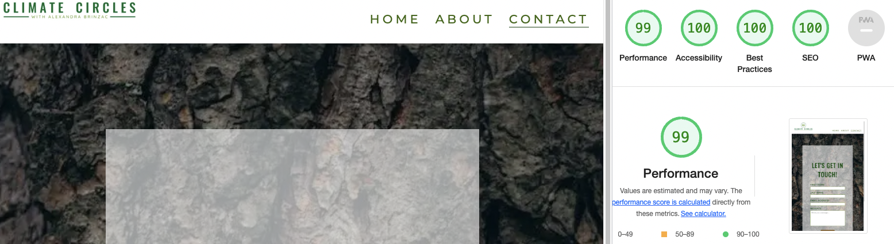

# Climate Circles
## Milestone Project One

This website was created for Alexandra Brinzac, a psychologist specialised in experiential psychotherapy with a passion for climate psychology, ecopsychology, and nature-based therapies. After all the studies and experience that she gathered, she decided it was time to move further and create "Climate Circles" a place for people with the same love for nature, connection, and Planet Earth. The role of this website is to raise awareness about the importance of being in a circle and working together towards creating a just and regenerative world. We are achieving this goal through workshops such as "The World That Reconnects," Climate Circles, and Forest Bathing sessions. 
***
## Demo

You can view the live website here - [Climate Circles](https://teodoraalina.github.io/climate-circles/)

You can view the GitHub repository here - [TeodoraAlina/climate-circles](https://github.com/TeodoraAlina/climate-circles)


***


## User Experience (UX)

## Strategy

### User Stories
#### First time Visitor Goals
* As a first-time visitor, I want to understand the main purpose of the site with ease;
* As a first-time visitor, I want to be able to navigate throughout the site with ease;
* As a first-time visitor, I want the site to be visually appealing regardless of screen size;
* As a first-time visitor, I want the links to function properly;
* As a first-time visitor, I want to find out more about the workshops;
* As a first-time visitor, I want to get in touch easily.

#### Returning Visitor Goals
* As a returning visitor, I want to know the times when the workshops are held.

#### Reasons a user may visit the website
* A user looking to know more about Alexandra;
* A user seeking a new hobby;
* A user conducting research on our services;
* A user who wishes to spend more time in nature;
* A user searching for a way of relaxing.
#### Reasons for the Website
* Showcase work;
* Raise environmental consciousness;
* Make it possible for people to contact Alexandra;
* Increase people's participation in the workshops.

## Scope
* Let the audience know who we are and what we do;
* Tell the audience about the workshops;
* List the times of the workshops;
* Persuade the audience by sharing the experiences (testimonials) of other participants;
* Make it easy to get in touch by telephone, email, social media, or contact form.


## Structure

Based on the content required in the scope, this website will consist of 3 pages:

* A Home Page, which will contain a small biography of Alexandra, testimonials, and the meet-up times;
* An About Page with descriptions and benefits of the workshops;
* A Contact Page with a form to get in contact with Alexandra.

## Skeleton
* Home Page Wireframes - [desktop](assets/images/home-page-desktop.webp) / [mobile](assets/images/home-page-phone.webp) / [tablet](assets/images/home-page-ipad.webp).
* About Page Wireframes - [desktop](assets/images/about-page-desktop.webp) / [mobile](assets/images/about-page-phone.webp) / [tablet](assets/images/about-page-ipad.webp).
* Contact Page Wireframes - [desktop](assets/images/contact-page-desktop.webp) / [mobile](assets/images/contact-page-phone.webp) / [tablet](assets/images/contact-page-ipad.webp).

## Surface

### Imagery

The images from the workshops in the About Page were given by Alexandra from her workshops, as was the photo from "Meet Alexandra" on the Home Page.
The Hero image from the Home page was chosen because of the simple feeling that it sends you when you look at it, giving you a peaceful vibe when entering the website. The images from the "Meet-up Times" section were chosen to match the vibes of the workshops. A tree stem for the background of the Contact Form was chosen to provide a nice contrast and to keep the nature theme consistent throughout the website. 

### Colour
Three types of green were used on the entire website, which goes perfectly with the theme of the website. The background color white has been kept for contrast, and white has also been used in writing on images for the same reason.

### Typography

For fonts, https://fonts.google.com/ has been used. "The Oswald" font has been chosen for headers. Initially, "Quicksand" has been chosen for the content, but because the contrast was not sufficient, it has been changed to Montserrat, which is a similar font but has better contrast and readability. 

The following code has been imported into the top of the style.css file:
```
@import url('https://fonts.googleapis.com/css2?family=Montserrat:wght@500&family=Oswald&display=swap'); 
```
### Call to Action
* The links in the Navigation bar are highlighted with a border bottom when the mouse is hovered over them.
* On the "About" page, the workshops have been styled as buttons to make them more inviting for users to click. When hovered over, the colors switch.
* The "Submit" button has a nice, earthy brown color that goes perfectly with the background on the "Contact" page. The colors change when hovered over.
* The social media links will send the user to Alexandra's social media pages. They also change colour when hovered over.
***

## Features
### Navigation Links and Logo

The navigation links and logo are placed at the top of the screen. In bigger screen sizes, the logo stays in the left corner and the navigation links in the right corner of the screen. On smaller screen sizes, the logo is centered, and the navigation links go underneath the logo and are centered. When clicked, the logo takes the user to the home page. The navigation links direct the user to the correct page of the website.


### Responsiveness

The page is scaled up and down for different screen resolutions to help the content stay neat. This has been done using media queries.


### Accessibility

All images and navigations have an alt attribute or aria-label. This is to make the site easier to use for people with visual impairments by allowing them to navigate the site easily. There is high contrast used throughout the design. Header elements have been used in sequence so that the site makes semantic sense to screen readers. Links are consistent when hovered over.


### Footer

The footer is split into two sections: "Contact Info" and "Social Links". On smaller devices, the two sections are stacked, while on larger devices, they are arranged in two columns.
The "Contact Info" section includes the email and telephone number of Alexandra, where she can be reached. The last section with the social links has links to social media sites using icons from Font Awesome. When hovered over, these links change from a lighter green colour to a darker shade of green colour.


### Home Page

Consists of:
* A hero image and a nice quote from Robin Wall Kimmerer to ease users into the website's depths.
* A bio section with information about Alexandra and an image of her. On smaller devices, the two elements are stacked, and on larger devices, they go into two columns. On the smaller devices, there is no letter spacing, and the text is made justified.
* A "Testimonials" section, listing three persons and their nice words about the workshops and Alexandra. On smaller devices, the images become smaller. As in the bio section, on the smaller devices there is no letter spacing, and the text is made justified.
* A section titled "Meet-up Times," which consists of three images with the names, times, and locations of the workshops written on them. On bigger devices, they are presented in a row. When the screen size becomes smaller, they become stacked.


### About Page

* In the first section, I have used a hero image and a container that has a title, a small description of the workshops, and three buttons that send you to each workshop section. On larger devices, the image is kept on the left side of the screen and the container is kept on the right. When the screen size becomes smaller, the image goes into the back of the container.
* For the workshops sections, I have used the same style as for the first section.
* The Workshops sections include a description of the workshops as well as their benefits.
* "The Work That Reconnects" and "Climate Circles" have images taken by Alexandra from the workshops.
* For "Forest Bathing" I have searched for a picture that can relate perfectly with the means of the workshop,


### Contact Us Page

Consists of:
* A Contact Form
* The form includes fields for the user to enter their contact details using - input type="text".
* The email input field requires the answer to be an email.
* There is a - textarea - to allow the user to ask for any further details. I have used placeholder text to encourage the user to make any further comments.
* The submit button is large and changes colour when hovered over.
* The labels are clear as to what should go in the field, and all fields are set to "required".
***

## Technologies Used
* HTML5 - Mark-up language using semantic structure.
* CSS3 - Cascading style sheet used for styling.
* Gitpod.io - For writing the code, using the command line for commiting and pushing to GitHub.
* GitHub - Used to host the repository.
* Git - Used for version control of the project.

* [Google fonts](https://fonts.google.com/) - For styling the typography.
* [Balsamiq wireframe](https://balsamiq.cloud/) - To build wireframes in the design phase.
* [Font Awesome](https://fontawesome.com/) - For the social media icons.
* [Beautifier](https://beautifier.io) - To beautify my code.
* [Tiny PNG](https://tinypng.com/) - To compress my images.
* [Online-Convert](https://image.online-convert.com/convert-to-webp) - To convert my images to WebP.
* [HTML Validator](https://validator.w3.org/#validate_by_input) - Testing validity of HTML.
* [CSS Validator](https://jigsaw.w3.org/css-validator/) - Testing validity of CSS.
* [Am I Responsive](https://ui.dev/amiresponsive#) - Checking the responsive nature and creating the mock-ups provided.
* DEV Tools - Lighthouse.
***

## Testing
* Tested whether the logo returns the user to the main page.
* Tested to see if the navigation bar works and the user is sent to the correct page of the site.
* Tested the buttons on the "About" page to see if they redirect the user to each section.
* Tested that the "Submit" button works.
* Attempting to submit the form without required fields results in a browser error message.
* Attempting to submit the form with an email that doesn't contain the appropriate tokens results in a browser error message.
* Submitting the form with all the correct information provided, sends the user to the Code Institute form dump, which displays data from all the fields.
* Clicking on the social media links in the footer results in the browser navigating to the appropriate social media site homepage (currently a placeholder for the real social media pages) in a new browser tab.

The W3C Markup Validator and W3C CSS Validator Services were used to validate all pages of the project to ensure there were no syntax errors in there.

* [HTML Validator](https://validator.w3.org)


* [CSS Validator](https://jigsaw.w3.org/css-validator/)


### Performance Testing

I have tested using the Developer Tools Lighthouse for desktop and mobile :

### Desktop





### Mobile


### Browser Compatibility

I have tested my website on the following:
* Google Chrome(desktop and mobile);
* Safari(desktop and mobile);
* Mozila Firefox(desktop and mobile).

### OS Compatibility

Tested on iOS, macOS and Android. Tested for responsiveness using Chrome DevTools.

### Testing User Stories

* A user looking to know more about Alexandra.

The user can easily find information about Alexandra on the "Home" page.

* A user seeking a new hobby.

This website introduces the user to his new hobby by offering three different workshops to attend. 

* A user conducting research on our services.

The user can find information and testimonials on the main page, as well as the dates and times of workshops. They can then go to the "About" page to find more information and images about the workshops.

* A user who wishes to spend more time in nature.

The user can easily find what he is looking for on the website. The three different workshops provide the time needed in nature. He can find the times and location on the main page, in the last section.

* A user searching for a way of relaxing.

The user can easily observe that this is what the workshops are offering. In the "About" page, descriptions and benefits are listed for each workshop.
***

## Deployment

### Delpoying to GitHub Pages

The project was deployed with the following steps

* Log into GitHub;
* Click the "Settings" button in the menu above the Repository;
* Scroll down the Settings page to the "GitHub Pages" Section;
* Under "Source", click the dropdown called "None" and then select "Master Branch";
* The page will automatically refresh, and a link displaced. It may take some time for the link to show the website.
* If the page will not load go down to "template" under the "source" and select a template.
* Scroll back down through the page to locate the now published site link in the "GitHub Pages" section.

### Forking

Forking the GitHub Repository

By forking the GitHub Repository, you can make a copy of the original repository in your own GitHub account. This means we can view or make changes without making the changes affecting the original.

* Log into GitHub and locate the GitHub Repository;
* At the top of the Repository there is a "Fork" button about the "Settings" button on the menu;
* You should now have a new copy of the original repository in your own GitHub account.

### Cloning
 
 Taken from GitHub's documentation on cloning, which can be found [here](https://docs.github.com/en/repositories/creating-and-managing-repositories/cloning-a-repository#cloning-a-repository-to-github-desktop) :
 
* Once logged into GitHub, navigate to the repository you wish to clone.
* Next to the green Gitpod button there's a button that reads code, click this.
* To clone the repository using HTTPS, copy the link whilst HTTPS is selected.
* Open your local IDE of choice and open the terminal.
* Navigate to the working directory of where you want the cloned directory to be.
* Type ```git clone``` in the terminal and then paste the link that you selected in step 3. Press enter.
* The clone is created in your current working directory (```cwd```).

### Adding and commiting files

I’ve been using Gitpod to write my code and using the terminal within to add, commit and push code from my workspace to GitHub where it is stored remotely as shown in the course content.

* When I have made a couple of minor additions / changes or one large change or addition I add the file in question to the staging area by typing in the terminal git add . the full stop will add all new files.
* I now want to save my changes to the local repository by typing git commit –m “ ” into the terminal. Between the “ ” I'll write a concise message detailing what this commit has done.
* When I either want to upload all my changes for the day or view on GitHub Pages I push all the commits I’ve previously done to GitHub using the git push command. When GitHub Pages is set up for the repository in question it will automatically pick up these changes and display the most up to date version that has been pushed.
***
## Acknowledgements
### Credit
* Alexandra Brinzac, who allowed me to this site based on her information and supplying the content.
* Tutor support at Code Institute for their help when required.
* My mentor, Brian Macharia, for helping and guiding me through this project during the mentor sessions.
* [Code Institute SampleREADME](https://github.com/Code-Institute-Solutions/SampleREADME)
* [W3schools](https://www.w3schools.com) - for various code information.
* [Balsamiq wireframes](https://balsamiq.cloud/) - To build wireframes in the design phase.
* [Pexels](https://www.pexels.com/) - for the images used in the website.
* [Beautifier](https://beautifier.io) - To beautify my code.
* [Tiny PNG](https://tinypng.com/) - To compress my images.
* [Online-Convert](https://image.online-convert.com/convert-to-webp) - To convert my images to WebP.
* [HTML Validator](https://validator.w3.org) - Testing validity of HTML.
* [CSS Validator](https://jigsaw.w3.org/css-validator/) - Testing validity of CSS.
* [Am I Responsive](https://ui.dev/amiresponsive#) - Checking the responsive nature and creating the mock-ups provided.
* [Logo](https://logo.com/) - Making the logo for the website.
### Code
The "About" page was based on the code from [this website](https://fantacydesigns.com/about-us-page-design), which I customised for my needs.


